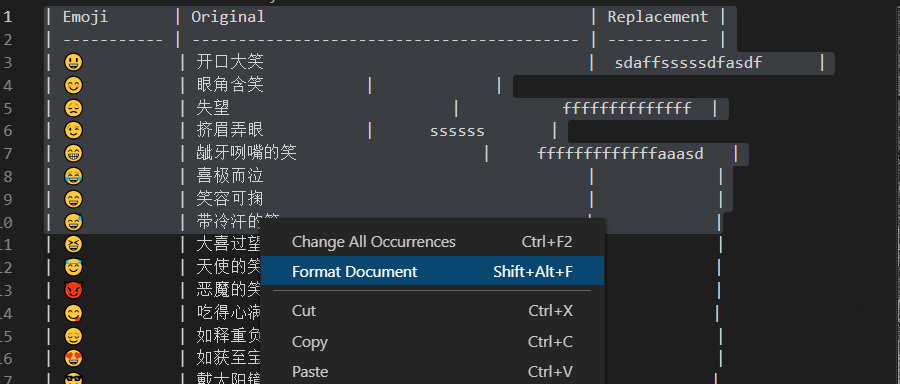

# 准备
1. 下载安装[Visual Studio Code][1].

   

2. 搜索安装插件 **Markdown All in One**

   

# 编辑文档说明
- 文档表格修改：文档采用markdown格式完成表格工作。**注意：不要添加或删除竖线 (|)**。其他规范可参考[此链接][2]   
  下图为表格部分说明

    

- 格式化文档：当文档由于编辑产生缩进问题时，可以使用编辑器自带格式化功能格式化。   
  `Before`

  

  `After`

  

[1]: https://code.visualstudio.com "Visual Studio Code"
[2]: https://www.jianshu.com/p/191d1e21f7ed  "Markdown document"